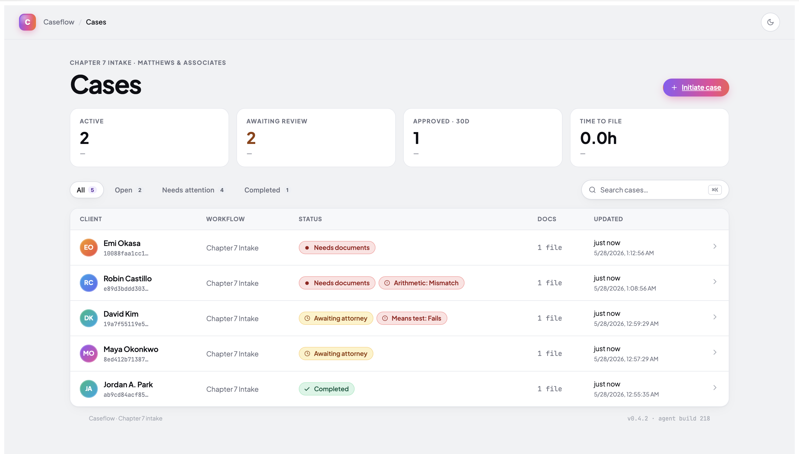

# Caseflow

> Upload one document. The system runs the case forward through a Chapter 7 intake workflow as far as it safely can — and stops to ask the human when it can't. Every AI decision is logged in an audit trail.



**Agentic AI workflow for Chapter 7 bankruptcy intake**.

---

## Quick start

Demo mode — no API key required (the default Mock provider runs offline):

```bash
docker compose up --build
```

Open <http://localhost:8080>.

Real OpenAI mode:

```bash
cp .env.example .env
# Edit .env: set LLM_PROVIDER=OpenAI and OPENAI_API_KEY=sk-...
docker compose up --build
```

---

## What the demo shows

1. **Workflow table** — every case, status badge, last updated
2. **Upload form** — paralegal initiates a case with a bank statement PDF
3. **Case workspace** —
   - Status badge for the current state (`documentReceived` → `classified` → … → `approved`)
   - **"Run agent"** button — synchronous, ~1 second of server work
   - Staggered slide-in **activity feed** showing planner reasoning for every step
   - **Extracted data panel** with per-field confidence bars
   - **Means test result**, **deadline schedule** (with legal citations), **arithmetic reconciliation**
   - **Approval queue** at the mandatory attorney checkpoint
4. **Approval** → case transitions to `approved`


---

## Tech stack

- **Backend:** .NET 10 LTS, ASP.NET Core Minimal API, EF Core 10, SQLite
- **Frontend:** React 18 + TypeScript 5.5+, Vite 5, React Router 6 — no state library, no UI framework, native `fetch`
- **LLM:** OpenAI .NET SDK 2.10 with **tiered model routing** —
  - `gpt-5.4-nano` for planner + classification (JSON ranking)
  - `gpt-5.4-mini` for vision-heavy extraction + email drafting
- **Infra:** single multi-stage Docker container + named volume for SQLite + uploaded documents

See [DESIGN.md](DESIGN.md) for the full specification.

---

## Architecture

### The agent loop

State machine (DESIGN §3):

```
[upload]  →  documentReceived  →  classified  →  extracted
                                                     ↓
                                              analysesPending
                                                     ↓
                                                  analyzed
                                                     ↓
                                          attorneyReviewPending  ─┐
                                                     ↓            │
                                            approved  (or)  flagged
```

Per iteration of `AgentOrchestrator.RunUntilCheckpointAsync` (DESIGN §7):

1. Load case **snapshot**
2. Compute **valid tools** from current state
3. **Planner** picks next action (returns `{nextAction, reasoning, alternativesConsidered, estimatedConfidence}`)
4. **State machine** re-validates the planner's choice — invalid choice → flag the case
5. **Policy** evaluates the chosen tool (`AutoExecute` / `AskHuman` / `Forbid`)
6. Execute the tool
7. Apply the result **atomically** (state transition + persistence + audit events in one `SaveChanges`)
8. Loop until terminal, blocked-on-human, step cap, or duration cap

### The nine-tool catalog (DESIGN §4)

| Category | Tools |
|---|---|
| State-only | `FlagForAttorneyReview` (abort lever), `RequestAttorneyApproval` (mandatory checkpoint) |
| Perception (LLM) | `ClassifyDocument` (Nano), `ExtractBankStatement` (Mini), `ExtractPayStub` (stub) |
| Pure-code computation | `ComputeMeansTest`, `CalculateDeadlines` (FRBP 9006), `CheckArithmeticIntegrity` |
| Generation (LLM, AskHuman policy) | `DraftClientEmail` (Mini — never sends autonomously) |

### Critical structural rule

**The more legally consequential the tool, the less LLM is involved.**

- Means test → pure code
- Deadlines → pure rule engine, citing **Fed. R. Bankr. P. 9006**
- Classification + extraction → LLM (perception)
- Client emails → LLM, but always human-gated

### Safety scaffolding

- **State machine constrains the action space.** Encoded as a data-driven dictionary, inspectable as JSON, exhaustively testable.
- **Strict structured outputs** — `jsonSchemaIsStrict: true` rejects any LLM response that deviates from the per-call schema.
- **Per-field confidence** — `ExtractedField<T>` forces granular `{value, confidence}` pairs in the JSON schema. The policy threshold checks `Min(allConfidences)`, not mean. The model **cannot hide** a smudged field by averaging.
- **Validation wall** — the orchestrator validates every planner choice against the state machine again. The LLM proposes; the state machine + policy dispose.
- **Append-only audit log** — `DbContext.SaveChangesAsync` override throws on any `CaseEvent` modification or deletion. Legal-defensible by construction.
- **SHA-256 content-addressed case IDs** — same bytes = same case = no duplicate uploads.

---

## Configuration

Set in `.env` or as shell exports. `Program.cs` bridges all 7 user-friendly env var names into ASP.NET config keys, so the same names work in local dev, shell `export`, and Docker.

| Var | Default | Purpose |
|---|---|---|
| `LLM_PROVIDER` | `Mock` | `Mock` (default, offline) or `OpenAI` |
| `OPENAI_API_KEY` | — | Required when `LLM_PROVIDER=OpenAI` |
| `LLM_MODEL_NANO` | `gpt-5.4-nano` | Model for planner + classification |
| `LLM_MODEL_MINI` | `gpt-5.4-mini` | Model for extraction + email drafting |
| `LLM_CONFIDENCE_THRESHOLD` | `0.70` | Per-field confidence floor — extraction flags below this |
| `AGENT_MAX_STEPS` | `8` | Orchestrator step cap per run |
| `AGENT_MAX_DURATION_SECONDS` | `25` | Wall-clock cap per run |

---

## API surface

All endpoints under `/api`. The frontend types in `frontend/src/types.ts` are the canonical wire contract.

| Method | Path | Body | Returns |
|---|---|---|---|
| GET | `/api/cases` | — | `Case[]` |
| POST | `/api/cases` | multipart: `clientName`, `document` | `Case` (201, idempotent on SHA-256) |
| GET | `/api/cases/{id}` | — | `Case` or 404 |
| POST | `/api/cases/{id}/run` | — | `AgentRunResult` |
| GET | `/api/cases/{id}/events` | — | `CaseEvent[]` |
| GET | `/api/cases/{id}/extraction` | — | `BankStatementExtraction` or 204 |
| GET | `/api/cases/{id}/analyses` | — | `{ meansTest?, deadlines?, arithCheck? }` |
| GET | `/api/cases/{id}/approvals` | — | `PendingApproval[]` |
| POST | `/api/approvals/{id}` | `{ decision: "approve" \| "reject", notes? }` | resolved `PendingApproval` |

---

## Notes on LLM choices

**Tiered model routing — task-fit, not one-size-fits-all.**

| Call site | Model | Why |
|---|---|---|
| Planner (every step) | nano | JSON ranking from a constrained menu — textbook nano |
| `ClassifyDocument` | nano | Multi-class labeling |
| `ExtractBankStatement` | mini | Vision-heavy; per-field confidence quality matters |
| `DraftClientEmail` | mini | Client-facing generation quality |

**Cost per case** (typical run, OpenAI mode):

- 5–6 nano planner calls @ ~$0.0001 each
- 1 nano classification @ ~$0.0001
- 1 mini extraction @ ~$0.0005

**Total: under 1¢ per case end-to-end.**

The architectural point: the routing is the senior signal, not the model brand. *"I picked the cheapest model that could do each call."*

---

## Out of scope for this prototype

(Per DESIGN §13, plus limitations discovered during build):

- Authentication / multi-tenancy
- Real PACER integration
- Multiple workflow types beyond Chapter 7
- `ExtractPayStub` — stub that returns failure
- Cloud storage (uses local filesystem on the named Docker volume)
- Production observability (OTEL, metrics, tracing)
- Retries / circuit breakers on LLM calls
- Streaming agent responses (SSE) — request/response is synchronous
- Real means-test inputs — uses one month of bank deposits as proxy. Production wants a 6-month pay-stub look-back per 11 U.S.C. § 707(b)(2)
- Real federal holiday calendar (hardcoded 2026)
- Tests beyond the `MeansTestCalculator` unit tests (3 cases)
- Per-firm policy configuration UI
- Production database (uses SQLite)
- **Real PDF vision in `OpenAiLlmProvider`** — text-only chat in this build; the PDF bytes are stored but **not sent to the LLM**. Production would rasterize via PdfPig + image content parts, or migrate to OpenAI's Files + Responses API. `LlmCompletionRequest.DocumentPath` is already wired into the request record for the future implementation.
- **AskHuman approval flow is fully wired only for `RequestAttorneyApproval`.** Other AskHuman-policy tools (e.g., `DraftClientEmail`) create `PendingApproval` rows, but resolving them doesn't re-invoke the tool. Production would re-execute the gated tool after the human approves.

---

## Repository layout

```
caseflow/
├── README.md            ← this file
├── DESIGN.md            ← build specification (the contracts)
├── Dockerfile           ← multi-stage build (node → SDK → aspnet)
├── docker-compose.yml   ← single service, named volume at /data
├── .env.example         ← env var contract
│
├── backend/             ← .NET 10 + ASP.NET Core Minimal API
│   ├── Agent/           ← StateMachine, IPlanner + Mock + OpenAi, AgentOrchestrator
│   ├── Tools/           ← 9 ITool implementations + ToolRegistry
│   ├── Compute/         ← MeansTestCalculator, DeadlineEngine, FederalHolidayCalendar
│   ├── Services/        ← DocumentStore, AuditLog, CaseStore
│   ├── Services/Llm/    ← ILlmProvider + Mock + OpenAi + schemas + prompts
│   ├── Endpoints/       ← CasesEndpoints, ApprovalsEndpoints
│   ├── Models/          ← entities, payloads, ExtractedField<T>
│   └── Data/            ← AppDbContext (append-only enforcement)
│
├── frontend/            ← React 18 + Vite 5 + TS 5.5+
│   └── src/
│       ├── components/  ← StatusBadge, ConfidenceBar, ActivityFeed, ApprovalQueue, ExtractedDataPanel
│       ├── pages/       ← CasesList, NewCase, CaseWorkspace
│       ├── types.ts     ← wire format types
│       └── api.ts       ← typed fetch wrappers
│
├── tests/Caseflow.Tests/  ← xUnit; MeansTestCalculator unit tests (3 cases)
│
└── screenshots/         ← 3 demo screenshots
```

---

## Local development (without Docker)

Backend on `:5050` (the macOS-friendly port — `:5000` is reserved for AirPlay):

```bash
cd backend && dotnet run
```

Frontend on `:5173` (Vite proxies `/api` to `:5050`):

```bash
cd frontend && npm install && npm run dev
```

Tests:

```bash
cd tests/Caseflow.Tests && dotnet test
```

---

## Decisions: the short version

- **Agentic, not form-driven.** Glade's product is workflow automation — the agent realizes "scale your practice, not your team."
- **Constrained agent pattern.** State machine + per-tool policy constrain what an LLM can choose. Defensible in legal AI specifically.
- **Tiered model routing.** Cheapest model that does each call. Nano for ranking, mini for vision.
- **Strict structured outputs.** Schema enforced server-side — no defensive parsing.
- **Per-field confidence with `ExtractedField<T>`.** `Min`, not mean. Preserves the worst-confidence field.
- **SHA-256 case IDs.** Content-addressed, deterministic, idempotent. Not `string.GetHashCode()` (process-randomized in .NET Core).
- **Append-only audit log enforced at the DbContext level.** Service-layer guards can be bypassed; the `SaveChanges` wall cannot.
- **Mock-first development.** Every LLM-backed interface has a Mock with deterministic fixtures. Demo runs offline; tests don't touch the network; dev iteration costs $0.
- **Strategy pattern.** Flip `LLM_PROVIDER=OpenAI` to swap from Mock to real — same demo, same code path. Last-registered DI wins.


---

## Things I would do differently in production

- **Streaming agent run via Server-Sent Events** — the synchronous request works for the prototype but won't scale to longer agent runs
- **Polly retries** with exponential backoff on LLM calls
- **PostgreSQL** via the EF Core provider swap (one-line change in `Program.cs`)
- **Real PDF vision** — rasterize with PdfPig + ImageSharp and pass as image content parts, or migrate to OpenAI's Files + Responses API
- **Per-state median income table** for the actual means test (the prototype uses one national-average threshold)
- **OTEL structured logging** to Datadog / App Insights
- **Real authentication** — Entra ID with per-firm tenancy
- **A second LLM-as-judge layer** to spot-check the agent's decisions before they hit production
- **Per-firm policy configuration UI** instead of hardcoded `ToolPolicy.DefaultDecision`
- **A health check endpoint** that returns 200 only after `EnsureCreated` completes (so Docker compose `healthcheck:` can gate dependent services)
